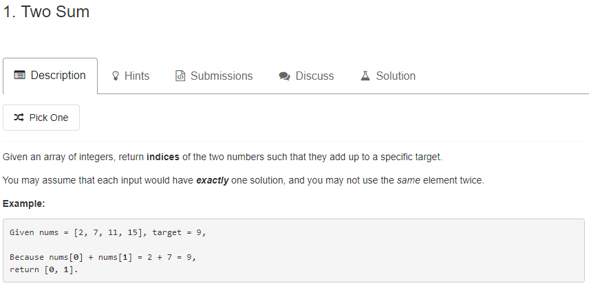
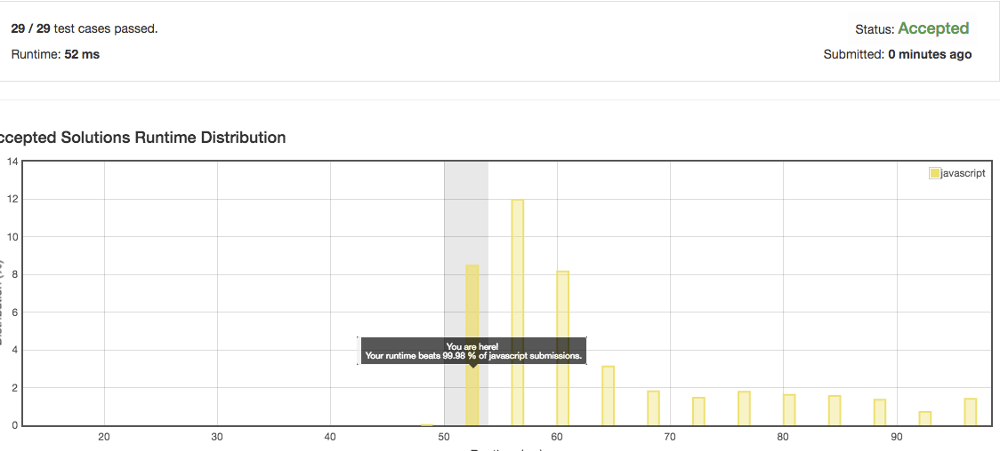

## JS

```JS
/**
 * @param {number[]} nums
 * @param {number} target
 * @return {number[]}
 */
var twoSum = function(nums, target) {
  let indexTable = {}
  for (let i = 0; i < nums.length; i++) {
    const complement = target - nums[i]
    if (indexTable[complement] !== undefined) {
      return [indexTable[complement], i]
    }
    indexTable[nums[i]] = i
  }
}
```

